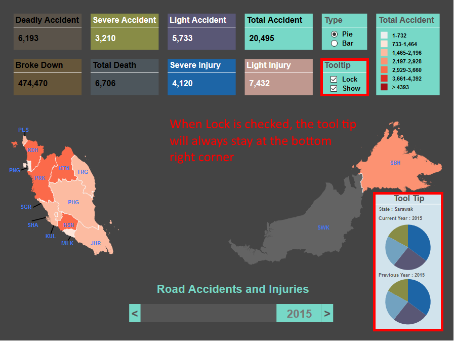

# Malaysia Accident Visualization

## This project is done in accordance to TDS3401 Data Visualization, Multimedia University (MMU), Trimester 3 2017/2018.

## Visualization Interface

## Legend changes with the data

## Multiple Legends

## Type of graph to be displayed in the tooltip can be changed

## The tooltip can be locked to the bottom right side of the view

## Enabling the tooltip

## Navigating the dataset through different years

.png
